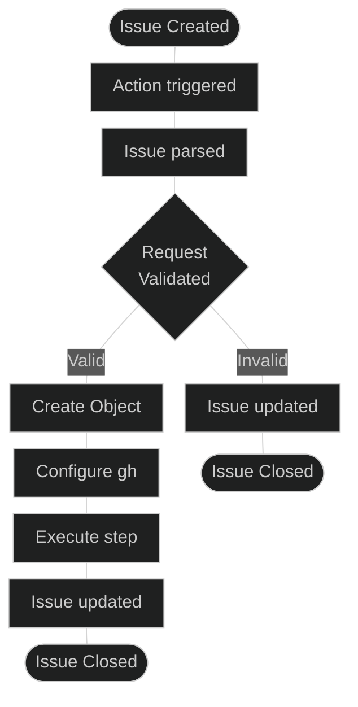

# GitHub Issue Operations via Actions

In this repository, we employ GitHub Issue Operations (Issue Ops) via GitHub Actions to facilitate a user-requested, self-service approach to GitHub features. This strategy optimizes our workflow by automating actions in response to issue interactions, effectively enabling users to request changes without requiring direct owner access. For instance, users can initiate the addition of a webhook to the repository simply by creating a specific issue. Upon detecting the creation of this issue the associated GitHub Action would validate the request and automatically add the webhook, thereby preserving user autonomy and ensuring a secure, efficient, and collaborative environment.

## A self-service approach for managing github components/settings across multiple github instances. 

### Architecture:
Issue ops lives inside the .github directory at the base of the repo. The framework itself relies on builtin GitHub constructs for `workflow/`, `ISSUE_TEMPLATES` directories and a best practice approach for `scripts/`. The only unique pieces of data are `ENTITLEMENTS/github.yml`, and `FORM_FIELDS`.

```bash
├── ENTITLEMENTS
│   └── github.yml
├── FORM_FIELDS
│   ├── repo-create.yml
│   ├── ...
├── ISSUE_TEMPLATE
│   ├── config.yml
│   ├── repo-create.yml
│   ├── ...
├── actions
│   ├── issue-op
│   │   └── action.yml
│   └── repo-create
│       └── action.yml
│   └── ...
├── scripts
│   ├── .coveragerc
│   ├── validation.py
│   └── validation_test.py
└── workflows
    └── issue-ops.yml
```

### `actions/`

Issue operations are comprised on GitHub composite actions. For every composite action an `actions.yml` exists. The composite action has a set of inputs it expects and executes the request. The request is typically executed using `gh` cli tool but doesn't have to be.

As you can see below the org webhook actions remains fairly small:

```yaml
runs:
  using: composite
  steps:
    - name: create an organization webhook
      shell: bash
      run: |
        active="$([[ "${{ inputs.active }}" == "["Enable"]" ]] && echo true || echo false)"
        gh api orgs/${{ inputs.organization }}/hooks \
          --input - << EOF
          {
            "name": "web",
            "active": $active,
            "events": ${{ inputs.events }},
            "config": {
              "url": "${{ inputs.webhook_url }}",
              "content_type": "${{ inputs.content_type }}"
            }
          }
        EOF
```
#### Dynamic Uses

The `uses:` directive in actions is not dynamic. This means you need to use `if` logic to determine the operation you want to run. This tends to pollute the actions log with a bunch of action steps that don't get run and we probably want to avoid that as operations increase in volume.

To avoid this we call a composite action that creates another composite action on the fly with our dynamic actions path. This allows us to call that composite action directly bypassing the need to determine which action downstream should be run.

I modified to https://github.com/jenseng/dynamic-uses to preprocess `JSON` ahead of time which makes our composite actions more explicit and easier to understand. 

### `ENTITLEMENTS/github.yml`
This directory has a single entitlements file that is specific to each target github instance. This file is used to validate against to determine if an org exists within an instance and if a user has entitlements to that organization. It's used in conjunction with `validate.py auth`.

```yml
github_instances:
  - instance: COM
    url: github.com
    organizations:
      - name: avocado-corp
        owners:
          - octocat
      - name: thehub
        owners:
          - hubber
  - instance: EMU
    url: github.com
    organizations:
      - name: enterprise-org
        owners:
          - mona
  - instance: GHES
    url: https://private.github.internal
    organizations:
      - name: enterprise-org-onprem
        owners:
          - jdoe
```

### `FORM_FIELDS/`
This directory houses YAML files that define the requisite form fields. Each file within this directory should adhere to the ISSUE_TEMPLATE naming convention and encompass a list of parsed issue identifiers. This is used in conjunction with `validation.py form` to ensure prohibited values are not present before making any requests or performing any production changes. 

```yml
required_fields:
  - instance
  - organization
  - repository
  - description
  - visibility
```
### `scripts/`
#### `validation.py`
This script is designed to consistently satisfy a few critical use cases

##### Authentication:
Validates the organization and verifies user entitlements to the organization using ENTITLEMENTS/github.yml.
Throws an error for invalid organizations.
Throws an error when the user lacks necessary entitlements.
##### Form Validation:
Ensures that the issue does not contain prohibited values (e.g., None, "", []). A required field must never be empty.
Throws an error when prohibited values are detected.
##### Hostname Resolution:
Provides a flat `JSON` object that it used to hydrate the ops request.

###### Additional notes:
`ENTITLEMENTS/github.yml` and `FORM_FIELDS` are sources of truth so it is worth noting that some of these values within validation.py are hardcoded. They could easily be moved to a config file if needed, but this ensures validation.py is always using the expected filesystem locations and expected sources.


##### validation.py auth
```
python .github/scripts/validation.py auth --help
usage: validation.py auth [-h] -i INSTANCE -o ORG -u USER

options:
  -h, --help            show this help message and exit
  -i INSTANCE, --instance INSTANCE
                        Name of the GitHub instance
  -o ORG, --org ORG     Name of the organization
  -u USER, --user USER  user (github.actor) to validate
```
##### validation.py form
```
python .github/scripts/validation.py form --help
usage: validation.py form [-h] -o OP

options:
  -h, --help      show this help message and exit
  -o OP, --op OP  The issue op name
```
##### validation.py payload
```
python .github/scripts/validation.py payload --help
usage: validation.py payload [-h] -i INSTANCE

options:
  -h, --help            show this help message and exit
  -i INSTANCE, --instance INSTANCE
                        Name of the GitHub instance
```

### Issue Ops Workflow

