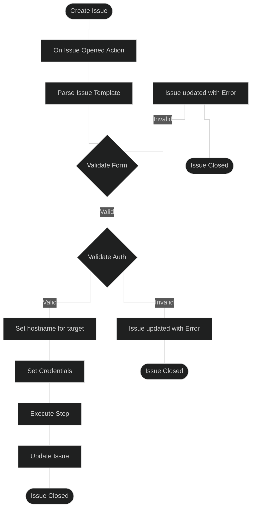

# issue-ops
## A self-service approach for managing github components/settings across multiple github instances. 

### Issue Ops Workflow


## Helper Scripts:

### set_hostname.py
Used to set the hostname of the github instance. We read the parsed issue template JSON file and based on the `instance` we return the associated hostname from the entitlemets file that can be used with the `gh` cli tool. 

```
usage: set_hostname.py [-h] --json JSON --yaml YAML

Find URL based on instance value from JSON and YAML files.

options:
  -h, --help   show this help message and exit
  --json JSON  Path to the JSON file.
  --yaml YAML  Path to the YAML file.
```

### validate_form.py
Used to ensure that prohibited form values are not present. This will surface the prohibited values for the form field(s) so the user understands why the issue been rejected. This is mostly used to detect required values not being set and to prevent unnecessary work.

This script has two inputs:
- `.github/ENTITLEMENTS/github.yml`
-  `${HOME}/issue-parser-result.json`

#### 

An example response when invalid values are determined for the workflow:

```JSON
{
  "prohibited_values":[
    {
      "instance":"None"
    },
    {
      "organization":""
    },
    {
      "payload_url":""
    },
    {
      "content_type":"None"
    },
    {
      "events":[
        
      ]
    }
  ]
}
```

```
usage: validate_form.py [-h] -j JSON_FILE -k REQUIRED_KEYS_FILE

Validate JSON file and keys.

options:
  -h, --help            show this help message and exit
  -j JSON_FILE, --json_file JSON_FILE
                        Path to the JSON file.
  -k REQUIRED_KEYS_FILE, --required_keys_file REQUIRED_KEYS_FILE
                        Path to the YAML file containing required keys.
```

### validate_auth.py
Used to ensure the user has access to the instance and org. If the usee does not permissions this will surface a permissions error so the user understands why the issue has been rejected

```
usage: validate_auth.py [-h] -g GITHUB_INSTANCE -o ORGANIZATION -u USER

validate github roles

options:
  -h, --help            show this help message and exit
  -g GITHUB_INSTANCE, --github_instance GITHUB_INSTANCE
                        Name of the GitHub instance
  -o ORGANIZATION, --organization ORGANIZATION
                        Name of the organization
  -u USER, --user USER  user (github.actor) to validate
```

It be could beneficial to understand how a user may obtain credentials via this error message (e.g. bubble solutions)


