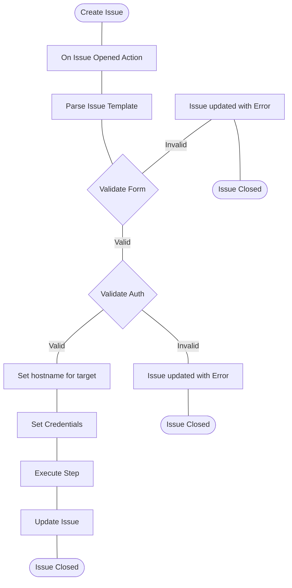

```mermaid
flowchart
	733212["Parse Issue Template"] --- 687741{"Validate Form"}
	164276["Issue updated with Error"] ---|"Invalid"| 687741
	164276 --- 862296(["Issue Closed"])
	687741 ---|"Valid"| 939737{"Validate Auth"}
	939737 ---|"Invalid"| 306145["Issue updated with Error"]
	306145 --- 397893(["Issue Closed"])
	939737 ---|"Valid"| 817495["Set hostname for target"]
	817495 --- 319413["Set Credentials"]
	319413 --- 721800["Execute Step"]
	687436(["Create Issue"]) --- 297482["On Issue Opened Action"]
	297482 --- 733212
	721800 --- 473259["Update Issue"]
	473259 --- 379849(["Issue Closed"])
```
